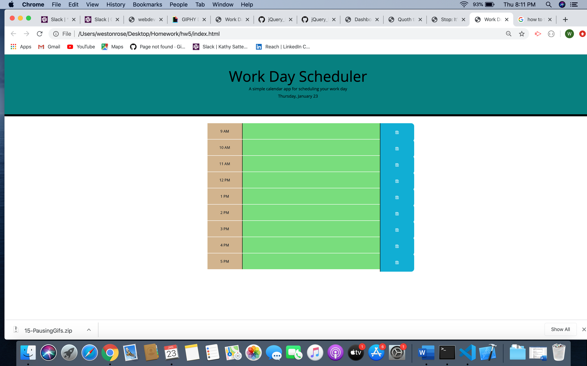

# Work Day Scheduler (Homework 5)
This web application is a simple calendar application that allows users to save events for each hour of the day after entering text in a time slot and clicking a save button. Additionally, time slots are color-coded to indicate whether a given slot is in the present (red), future (green), or past (gray).

### Included Files

* index.html
* style.css
* script.js
* README.md

## Deployment

[https://wrose001.github.io/hw5/](https://wrose001.github.io/hw5/)

## Images

 

## Built With

This work day scheduler was built using the jQuery framework, in addition to moment.js, both within the JavaScript file. HTML and CSS were also used.

## Contributing

Pull requests are welcome. For major changes, please open an issue first to discuss what you would like to change.

Please make sure to update tests as appropriate.

# Acknowledgments

Many thanks to Amanda for her guidance ain terms of jQuery. My classmate, Leandra Turner, was helpful in terms of setting up my jQuery file with document.ready and thinking through problems.

# hw5